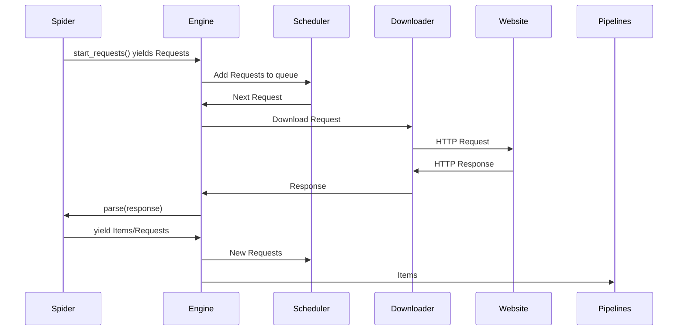

# Chapter 5: Your First Scrapy Spider

Think about the first time you hit "Enter" on a real Scrapy crawl. You've spent the afternoon reading documentation, trying to understand what a "yield" was and why you needed a "callback." You might feel like a pilot sitting in a cockpit for the first time, surrounded by buttons and dials you don't quite trust yet.

You run the command: `scrapy crawl basic_spider`.

The terminal comes alive. A waterfall of white and green text starts rushing past. You see names of websites, numbers corresponding to "HTTP 200" codes, and names of items you had defined. It's terrifying and beautiful. You might feel as if you're looking into the matrix.

"Is it working?" you might wonder. "Is it actually doing something, or is it just spitting out errors?"

Then, it stops. The terminal returns to the silent, blinking cursor. You type `cat quotes.json` and your screen fills with perfectly structured data. Every quote, every author, and every tag from the entire website is sitting there on your hard drive.

You didn't have to copy anything. You didn't have to paste anything. You have just instructed a machine to do your work, and it has obeyed you perfectly. You take a deep breath and realize that the world of data is now wide open to you. You aren't just a programmer anymore; you are a builder of digital harvesters.

In this chapter, you're going to get that same feeling. We are going to build your first spider from scratch. It won't just be a theoretical exercise; we're going to build a piece of software that actually goes out into the real internet and brings back treasure.

---

## Introduction

In the previous chapter, we set up our lab. Now, it's time to put on the lab coat and start experimenting.

In Scrapy, the program that does the actual work of visiting a website and extracting data is called a **Spider**. It's a fitting name because it "crawls" across the web from page to page.

We're going to use the most famous beginner-friendly website in the scraping world: [quotes.toscrape.com](https://quotes.toscrape.com). It was built specifically for people like us to practice our skills without worrying about getting banned or breaking anything.

By the end of this chapter, you will have created a full Scrapy project, written a functional spider, and saved your first set of scraped data to a JSON file.

## What is Scrapy?

Scrapy is not just a library; it is a **Framework**. 

If a library is like a single tool (like a screwdriver), a framework is like an entire factory. It provides the building, the conveyor belts, the power, and the organization. You just have to bring the specific instructions for what you want to build.

## Scrapy Architecture: The Complete Picture

You don't need to know every detail yet, but understanding Scrapy's architecture will help you debug issues and write better spiders.

### The Components

**1. The Engine** (scrapy.core.engine.ExecutionEngine)
- The orchestrator that coordinates all components
- Manages the request/response flow
- Single-threaded, event-driven

**2. The Scheduler** (scrapy.core.scheduler.Scheduler)
- Maintains the queue of requests to be processed
- Handles request prioritization
- Implements duplicate filtering
- Can be replaced with Redis for distributed crawling

**3. The Downloader** (scrapy.core.downloader.Downloader)
- Makes HTTP requests using Twisted
- Manages connection pooling
- Handles retries and timeouts
- Respects CONCURRENT_REQUESTS settings

**4. Downloader Middlewares**
- Process requests before they go to the Downloader
- Process responses before they reach spiders
- Examples: UserAgentMiddleware, CookiesMiddleware, RetryMiddleware

**5. Spiders** (Your Code!)
- Parse responses and extract data
- Generate new requests to follow
- Define what data to scrape

**6. Spider Middlewares**
- Process spider input (responses) and output (items/requests)
- Less commonly used than downloader middlewares

**7. Item Pipelines**
- Process extracted items
- Clean, validate, and store data
- Can filter out unwanted items

### The Request/Response Lifecycle

Here's what happens when you run a spider:



**Step-by-step:**

1. **Spider starts**: `start_requests()` generates initial Requests
2. **Engine receives**: Passes Requests to Scheduler
3. **Scheduler queues**: Adds to queue, checks for duplicates
4. **Engine asks**: "What's next?" Scheduler provides a Request
5. **Downloader fetches**: Makes HTTP request via Twisted
6. **Response returns**: Downloader passes Response to Engine
7. **Spider parses**: Engine calls your `parse()` method
8. **Spider yields**: Items go to pipelines, Requests go back to Scheduler
9. **Repeat**: Until queue is empty

> [!IMPORTANT]
> **Scrapy Doc Gap: The Scheduler's Duplicate Filter**
> By default, Scrapy won't visit the same URL twice. It uses a fingerprint of the request (URL + method + body) to detect duplicates.
> 
> This can cause issues:
> ```python
> # These are considered DIFFERENT requests (different query params)
> yield scrapy.Request('https://example.com?page=1')
> yield scrapy.Request('https://example.com?page=1&sort=price')
> 
> # These are considered the SAME (same URL)
> yield scrapy.Request('https://example.com', meta={'page': 1})
> yield scrapy.Request('https://example.com', meta={'page': 2})  # FILTERED!
> ```
> 
> To allow duplicates:
> ```python
> yield scrapy.Request(url, dont_filter=True)
> ```
> 
> Or disable globally:
> ```python
> # settings.py
> DUPEFILTER_CLASS = 'scrapy.dupefilters.BaseDupeFilter'  # No filtering
> ```

### Understanding yield vs return

This confuses many beginners. Let me explain:

**return**: Gives back one value and stops
```python
def get_number():
    return 5  # Function ends here
```

**yield**: Gives back values one at a time (generator)
```python
def get_numbers():
    yield 1
    yield 2
    yield 3  # Function pauses and resumes
```

**Why Scrapy uses yield:**

1. **Memory efficiency**: Process items one at a time, not all at once
2. **Asynchronous**: Engine can process items while spider continues
3. **Flexibility**: Can yield both Items and Requests

```python
def parse(self, response):
    # This processes 10,000 quotes without loading all into memory
    for quote in response.css('div.quote'):  # Could be millions
        yield {'text': quote.css('span.text::text').get()}
    
    # Can also yield new requests
    next_page = response.css('li.next a::attr(href)').get()
    if next_page:
        yield response.follow(next_page, self.parse)
```

**What happens behind the scenes:**
```python
# When you yield an Item:
item = {'text': 'Some quote'}
yield item
# Engine receives it, passes to Item Pipelines

# When you yield a Request:
request = scrapy.Request('https://example.com/page2')
yield request
# Engine receives it, passes to Scheduler
```

### Spider Signals

Scrapy has a signal system for hooking into the lifecycle:

```python
from scrapy import signals

class MySpider(scrapy.Spider):
    name = 'myspider'
    
    @classmethod
    def from_crawler(cls, crawler, *args, **kwargs):
        spider = super().from_crawler(crawler, *args, **kwargs)
        crawler.signals.connect(spider.spider_opened, signal=signals.spider_opened)
        crawler.signals.connect(spider.spider_closed, signal=signals.spider_closed)
        crawler.signals.connect(spider.item_scraped, signal=signals.item_scraped)
        return spider
    
    def spider_opened(self, spider):
        self.logger.info(f'Spider opened: {spider.name}')
        # Initialize resources (database connections, etc.)
    
    def spider_closed(self, spider, reason):
        self.logger.info(f'Spider closed: {reason}')
        # Cleanup resources
    
    def item_scraped(self, item, response, spider):
        self.logger.debug(f'Item scraped: {item}')
```

**Common signals:**
- `spider_opened`: Spider started
- `spider_closed`: Spider finished
- `spider_idle`: No more requests in queue
- `request_scheduled`: Request added to scheduler
- `response_received`: Response downloaded
- `item_scraped`: Item passed all pipelines

**Production use case:**
```python
def spider_opened(self, spider):
    # Send Slack notification
    self.slack.send(f"Spider {spider.name} started")
    
def spider_closed(self, spider, reason):
    # Send completion stats
    stats = spider.crawler.stats.get_stats()
    self.slack.send(f"Spider finished. Items: {stats.get('item_scraped_count', 0)}")
```

## Creating a Scrapy Project

Inside your virtual environment (remember to activate it!), navigate to your project folder and run:

```bash
scrapy startproject my_first_spider
```

Scrapy will create a new directory. Let's look at the structure:

```text
my_first_spider/
├── scrapy.cfg            # Project configuration
└── my_first_spider/     # Project's Python module
    ├── items.py          # Data structures
    ├── middlewares.py    # Request/Response hooks
    ├── pipelines.py      # Data cleaning and storage
    ├── settings.py       # Configuration settings
    └── spiders/          # Where your spiders live
```

For this chapter, we will spend all our time inside the `spiders/` folder.

## Your First Spider

Navigate into your new project: `cd my_first_spider`. Now, let's create a new file inside `my_first_spider/spiders/` named `quotes.py`. Paste this code in:

```python
import scrapy

class QuotesSpider(scrapy.Spider):
    # The unique name of your spider
    name = 'quotes'
    
    # The URLs where the spider starts
    start_urls = ['https://quotes.toscrape.com']

    def parse(self, response):
        """
        The 'parse' method is called automatically for every URL in start_urls.
        'response' contains the HTML of the page.
        """
        # We look for all 'div' elements with the class 'quote'
        for quote in response.css('div.quote'):
            yield {
                'text': quote.css('span.text::text').get(),
                'author': quote.css('small.author::text').get(),
            }
```

### The Three Basics
1.  **`name`**: This is how you tell Scrapy which spider to run.
2.  **`start_urls`**: A list of where to begin.
3.  **`parse`**: The logic for extracting data.

> [!IMPORTANT]
> **Scrapy Doc Gap: The "parse" Method Naming**
> Scrapy's documentation often uses the word "callback," which can be confusing. Here is the golden rule: If you use the `start_urls` list, Scrapy *expects* a method named exactly `parse`. 
> 
> If you rename it to `parse_quotes` but don't explicitly tell Scrapy to use it, your spider will visit the website and then do *nothing*. This is the #1 reason why beginners' spiders start but "don't scrape any data." Always double-check your method names!

## Running Your Spider

Go back to your terminal and run this command:

```bash
scrapy crawl quotes
```

You'll see a lot of logs. Look for the lines that start with `DEBUG: Scraped from`. If you see your quotes appearing in the terminal, you've succeeded!

## Scrapy Shell: Your Testing Playground

Writing code, running it, and finding an error is slow. The **Scrapy Shell** lets you test your selectors in real-time.

Type this in your terminal:
```bash
scrapy shell "https://quotes.toscrape.com"
```

Once inside, you can type commands to see the results instantly:
```python
response.css('h1::text').get()
# Output: 'Quotes to Scrape'

response.css('small.author::text').getall()
# Output: ['Albert Einstein', 'J.K. Rowling', ...]
```
The shell is your best friend for debugging. Type `exit()` to leave.

## Saving Your Data

Logging to the terminal is fun, but we want to keep the data. Scrapy makes this easy.

```bash
# Save to JSON
scrapy crawl quotes -O quotes.json

# Save to CSV
scrapy crawl quotes -O quotes.csv
```
The `-O` (capital O) tells Scrapy to "Overwrite" the file if it already exists.

## Common Beginner Mistakes

1.  **Running the command in the wrong folder:** You must be inside the top-level project folder for `scrapy crawl` to work.
2.  **Naming conflicts:** Don't name your project or your files the same as a library (like `scrapy.py`). It will confuse Python.
3.  **Forgetting `yield`**: In Scrapy, we use `yield` instead of `return`. `yield` allows the spider to keep working while it "outputs" the data it just found.

## Chapter Summary

**What we covered:**
- Scrapy is a framework that acts like a "data factory."
- The architecture consists of the Engine, Scheduler, Downloader, Spiders, and Pipelines.
- We created a project with `scrapy startproject`.
- We built a basic spider that extracts quotes and authors.
- We used the Scrapy Shell to test our selectors interactively.
- We saved our data to JSON and CSV formats.

**Key code:**
```python
# Minimal spider structure
class MySpider(scrapy.Spider):
    name = 'myspider'
    start_urls = ['https://example.com']
    def parse(self, response):
        yield {'data': 'Hello World'}
```

**Previous chapter:**
[Chapter 4: Setting Up Your Environment](./chapter_04_setting_up_your_environment.md)

**Next chapter:**
You've built your first spider, but you might be wondering: "How did you know to use `div.quote` or `span.text`?" In the next chapter, we are going to master **CSS Selectors and XPath** the maps we use to find anything on the web.

---

**End of Chapter 5**
