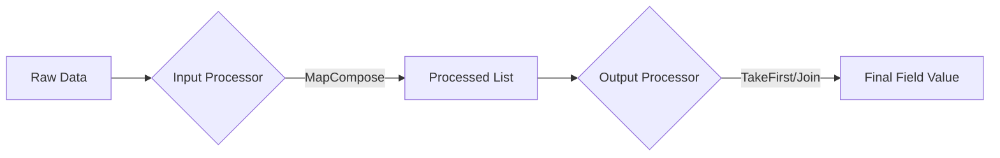

# Chapter 8: Scrapy Items and ItemLoaders

Imagine the first time you have to hand off a scraping project to a teammate. You're proud of your spider. It's fast, it follows links perfectly, and it returns a big list of Python dictionaries. You think you've done a great job.

A few hours later, your teammate calls you. "Hey," they say, "I'm trying to import your data into our database, but it's crashing. In some of your results, the price field is named `price`, but in others, it's called `Price` with a capital P. And for some reason, one of the products has the description where the title should be."

You might feel a flush of embarrassment. You'll realize that your "flexible" dictionaries are actually a liability. Because you hadn't defined a strict structure, you accidentally made typos and inconsistent labels throughout your code. Your spider was essentially "whispering" to the database in a language that changed every few minutes.

It's like trying to build a LEGO set where the bricks keep changing shape while you're holding them.

You could spend the next three hours going through your code, manually fixing every dictionary key. It feels like being pulled back into the world of manual labor that you tried so hard to escape. That's when you learn that professional scraping isn't just about *getting* data; it's about *defining* it.

In this chapter, you're going to learn how to use Scrapy Items and ItemLoaders to create a "contract" for your data. You'll never have to worry about a typo crashing your database again.

---

## Introduction

So far, we've been using simple Python dictionaries to store our scraped data. Dictionaries are great for quick prototypes, but they have a few major weaknesses:
1.  **They are silent about mistakes.** If you type `'prcie'` instead of `'price'`, Python won't complain until your data is already saved and broken.
2.  **They mixed extraction and logic.** Your spider becomes a mess of `.strip()`, `.replace()`, and `.join()` calls mixed in with your selectors.

In this chapter, we're going to solve both problems. We'll learn how to use **Items** to define the "schema" (the shape) of our data, and **ItemLoaders** to keep our extraction logic clean and reusable.

## What are Items?

In Scrapy, an **Item** is a simple container used to collect the scraped data. They provide a dictionary-like API but with one huge advantage: they are structured.

Think of an Item as a "form" that your spider has to fill out. The form has specific boxes (fields), and the spider isn't allowed to scribble in the margins or add its own boxes on the fly.

## Defining Items

Items are defined in the `items.py` file of your Scrapy project. Here is how you define a simple Item for a book:

```python
# items.py
import scrapy

class BookItem(scrapy.Item):
    title = scrapy.Field()
    price = scrapy.Field()
    stock = scrapy.Field()
    description = scrapy.Field()
```

By defining these fields, you are creating a "schema." If your spider accidentally tries to save a piece of data called `cost` (which isn't on the list), Scrapy will raise an error immediately. This is exactly what we want!

## Using Items in Spiders

To use the item in your spider, you just import it and fill it like a dictionary:

```python
from my_spider.items import BookItem

def parse(self, response):
    item = BookItem()
    item['title'] = response.css('h1::text').get()
    item['price'] = response.css('.price_color::text').get()
    yield item
```

## The New Way: ItemAdapter and Dataclasses

Since Scrapy 2.2, you aren't limited to `scrapy.Item`. You can use Python's built-in `dataclasses` or even `attrs` classes, and Scrapy will handle them using the `ItemAdapter` interface.

```python
# items.py
from dataclasses import dataclass

@dataclass
class Book:
    title: str
    price: float
    description: str = None
    url: str = None
```

**Why use Dataclasses?**
- Less boilerplate than `scrapy.Item`
- Type hinting support (IDEs love it)
- No dependency on `scrapy` in your data models

Scrapy uses `itemadapter` under the hood to treat dicts, Items, and dataclasses uniformly.

```python
from itemadapter import ItemAdapter

def process_item(self, item, spider):
    adapter = ItemAdapter(item)
    # Works for Dict, Item, or Dataclass!
    adapter['title'] = "New Title"
    return adapter.item
```

## ItemLoaders: Smart Data Loading

Now, let's talk about the real "pro" tool: the **ItemLoader**. 

If an Item is the "form," the ItemLoader is the "efficient clerk" who fills it out for you. ItemLoaders allow you to separate the **extraction** (finding the data) from the **processing** (cleaning the data).

### Why ItemLoaders solve the mess:
Without an ItemLoader, your spider looks like this:
```python
# Messy
item['price'] = response.css('.price::text').get().replace('$', '').strip()
```

With an ItemLoader, your spider looks like this:
```python
# Clean
loader = ItemLoader(item=BookItem(), response=response)
loader.add_css('price', '.price::text')
yield loader.load_item()
```
The "cleaning" logic moves into the `ItemLoader` definition, leaving your spider clean and easy to read.

## Built-in Processors

ItemLoaders use **Processors** to handle data. The two most common ones are:
1.  **MapCompose:** Runs a series of functions on every piece of data (like stripping whitespace or removing dollar signs).
2.  **TakeFirst:** Usually, Scrapy selectors return a list. `TakeFirst` tells the loader to just grab the first item in that list and save it as a string.

## Creating a Professional ItemLoader

You usually define your custom loader in `items.py` along with your items:

```python
from itemloaders.processors import MapCompose, TakeFirst
from scrapy.loader import ItemLoader

def remove_currency(value):
    return value.replace('$', '').strip()

class BookLoader(ItemLoader):
    default_output_processor = TakeFirst()
    price_in = MapCompose(remove_currency)
    description_in = MapCompose(str.strip)
```

### `_in` vs `_out`
*   **Input Processor (`_in`)**: Runs as soon as data is added to the loader. Use this for cleaning individual strings.
*   **Output Processor (`_out`)**: Runs when you call `load_item()`. Use this for deciding how the final data should look (like taking the first item of a list).

> [!IMPORTANT]
> **Scrapy Doc Gap: Input vs. Output Processors**
> This is the part of Scrapy that makes everyone’s head spin. Remember this rule: 
> 
> **Input processors** (`_in`) handle the raw data *one piece at a time* (e.g., stripping whitespace from three separate `<p>` tags). 
> **Output processors** (`_out`) handle the *collected list* of those pieces (e.g., using `TakeFirst` to pick the best one or `Join()` to merge them). If your data is coming back as a list like `['$19.99']` when you wanted `$19.99`, you probably forgot to set an output processor!

### Visualizing the Processor Flow



1. **Extraction**: `loader.add_css('title', 'h1::text')` finds `[' Title ', ' Subtitle ']`
2. **Input Processor**: `MapCompose(str.strip)` runs on *each* element.
   - Result: `['Title', 'Subtitle']`
3. **Output Processor**: `TakeFirst()` runs on the *whole list*.
   - Result: `'Title'`
4. **Assignment**: Item field is set to `'Title'`

### Processor Composition

You can chain functions in `MapCompose` for powerful cleaning pipelines:

```python
from itemloaders.processors import MapCompose
from w3lib.html import remove_tags

def parse_price(text):
    return float(text.replace('$', ''))

class ProductLoader(ItemLoader):
    # Order matters! Function 1 -> Function 2 -> Function 3
    description_in = MapCompose(remove_tags, str.strip, lambda x: x[:100])
    
    price_in = MapCompose(str.strip, parse_price)
```

## Nested Items: Handling Complex Structures

Sometimes your data isn't flat. You might have a Product that has a list of Variants or Review items inside it.

Scrapy items are valid field values for other Scrapy items!

```python
# items.py
import scrapy

class AuthorItem(scrapy.Item):
    name = scrapy.Field()
    bio = scrapy.Field()

class QuoteItem(scrapy.Item):
    text = scrapy.Field()
    tags = scrapy.Field()
    author = scrapy.Field()  # This will hold an AuthorItem
```

**Loading Nested Items:**

```python
def parse(self, response):
    quote = QuoteLoader(item=QuoteItem(), response=response)
    quote.add_css('text', '.text::text')
    
    # Create the nested item
    author = AuthorLoader(item=AuthorItem(), selector=response.css('.author'))
    author.add_css('name', '.name::text')
    
    # Assign the nested item to the field
    quote.add_value('author', author.load_item())
    
    yield quote.load_item()
```

> [!TIP]
> **Pro Pattern: Flattening vs Nesting**
> SQL databases (like Postgres) usually prefer **flat** data. NoSQL databases (like MongoDB) handle **nested** data well.
> 
> If you are exporting to CSV, nested items will look messy (JSON string in a cell). If you need CSV, flatten your data in the pipeline or spider. If you use JSON/JSONL, nesting is perfect.

## Default Values

Sometimes a website is missing data. You can set default values in your ItemLoader so your database always gets a consistent result (like `0.0` for a missing price instead of `None`).

```python
loader.add_value('price', '0.0') # Only used if add_css fails
```

## When to Use Items vs. Dictionaries

*   **Use Dictionaries:** For 5-minute scripts or when you're just exploring a site in the Scrapy Shell.
*   **Use Items:** For absolute certainty. Use them for any project that will run more than once or that involves a database.

## Chapter Summary

**What we covered:**
- **Items** define a strict structure (schema) for your data to prevent typos and inconsistencies.
- Items are defined in `items.py` using `scrapy.Field()`.
- **ItemLoaders** separate extraction logic from data cleaning.
- **Processors** like `MapCompose` and `TakeFirst` automate the "dirty work" of cleaning strings.
- Using Items makes your code more readable, maintainable, and robust.

**Key code:**
```python
# Defining a loader with processors
class MyLoader(ItemLoader):
    default_output_processor = TakeFirst()
    title_in = MapCompose(str.strip, str.title)

# Using it in a spider
loader = MyLoader(item=ProductItem(), selector=product_selector)
loader.add_css('title', '.name::text')
yield loader.load_item()
```

**Previous chapter:**
[Chapter 7: Extracting Data Like a Pro](./chapter_07_extracting_data_like_a_pro.md)

**Next chapter:**
Our data is now beautifully structured, but it might still have weird formatting, dates in the wrong time zone, or extra characters. In the next chapter, we're going to dive deep into **Data Cleaning Best Practices** to make your data truly production-ready.

---

**End of Chapter 8**
