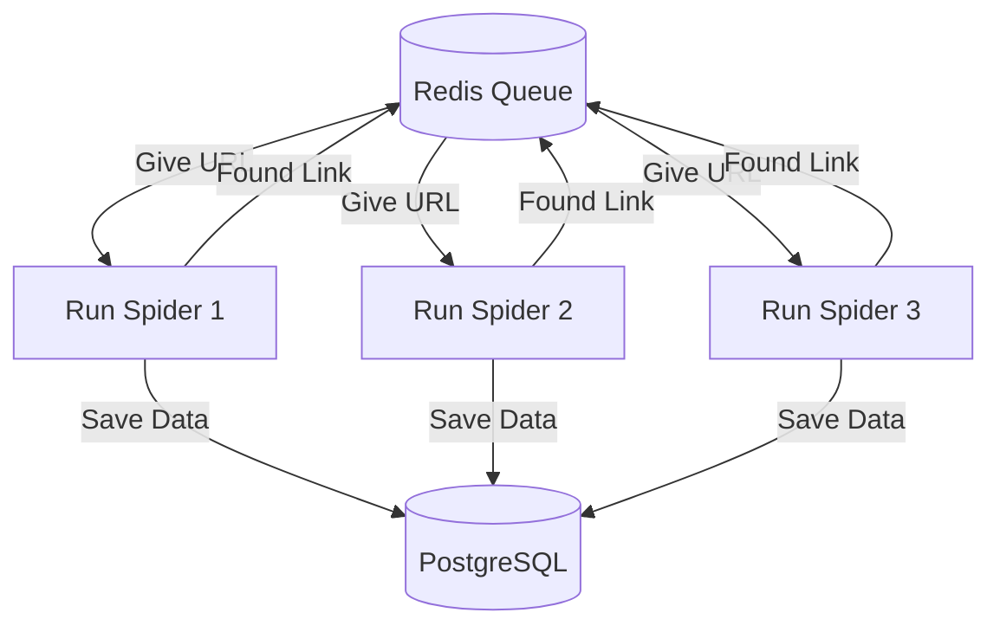

# Chapter 24: Understanding Distributed Crawling

Think about the day your "Super Spider" hits a brick wall. You've been hired to scrape a massive international job board with over fifty million listings. You've fine-tuned your settings, optimized your pipelines, and you're running the spider on the most powerful server you can rent. At your peak speed, you're collecting about five hundred listings per minute.

You might do the math and realize that to finish the whole site, your single spider would have to run for sixty days straight.

That's not the biggest problem, though. About four hours into the crawl, the job board's server might notice your IP address. They don't just block your spider; they might block your entire server. Suddenly, all your progress stops. You rent a new server, change your IP, and start again. Four hours later: blocked again.

You'll feel as if you're trying to move a mountain using only one very fast truck. No matter how fast you drive that truck, the people on the mountain can see it coming and just close the gate.

You'll realize you don't need a faster truck. You need a fleet of a hundred smaller trucks, all coming from different directions at different times. You need a "swarm." If any one truck gets stopped, the other ninety-nine can keep moving. And even better, a hundred trucks can move the mountain in a fraction of the time.

That realization will lead you into the world of **Distributed Crawling**. It will change your perspective from "How do I make this code faster?" to "How do I coordinate a system of machines to work as one?"

In this chapter, you're going to learn how to build that swarm.

---

## Introduction

So far in this book, we've treated "The Spider" as a single program running on a single computer. This is perfect for 99% of projects. But when you face massive datasets or aggressive IP blocking, a single spider isn't enough.

In this chapter, we're going to explore the architecture of scaling. We'll learn what "Distributed Crawling" actually means, how machines can share a "To-Do List," and the different tools available to coordinate a swarm of spiders. This is the bridge from "Scraping" to "Data Engineering at Scale."

## What is Distributed Crawling?

Think of a standard Scrapy spider like a lone researcher. They have a notebook (the Scheduler) and they visit websites one by one.

**Distributed Crawling** is like hiring a team of fifty researchers. But for them to work together, they can't each have their own notebook. They would end up visiting the same websites and repeating each other's work. Instead, they need a single, shared "Master Map" in the middle of the room. When one researcher visits a page, they cross it off the map so no one else goes there.

In technical terms, we move the **Scheduler** and the **Duplicate Filter** out of the individual machines and into a central database.

## When You Need Distribution

You should consider scaling to multiple machines when:
1.  **The dataset is massive:** If your crawl will take more than a week on one machine, you need to distribute the load.
2.  **You need to bypass IP limits:** By using five different servers (with five different IP addresses), you can scrape five times faster without triggering a "per-IP" ban.
3.  **You need high availability:** If one server crashes or the internet goes out, you want the rest of the swarm to keep working and pick up the slack.

## How Distributed Crawling Works: The Shared Queue

The heart of a distributed system is the **Shared Queue**. Instead of Scrapy keeping URLs in its local memory, it sends them to a central server usually **Redis**.

1.  **Machine A** finds a new link. It doesn't save it locally; it pushes it into the Redis queue.
2.  **Machine B** is idle. it asks Redis: "Is there any work for me?"
3.  Redis gives the URL to Machine B.
4.  Machine B scrapes the page and potentially finds more links to add back to the queue.

## Distribution Options

### 1. Scrapy-Redis
This is the most popular way to scale Scrapy. It's a library that replaces Scrapy's internal scheduler with a Redis-based one. It's simple to set up and works with almost any existing project. (We'll build this in the next chapter!)

### 2. Scrapy Cluster (Frontera)
A more complex, enterprise-level solution. It's designed for "perpetual" crawling (constantly revisiting millions of sites) and requires a dedicated team to manage.

### 3. Custom Cloud Solutions
In 2026, many developers use "Serverless" functions (like AWS Lambda) to run thousands of tiny Scrapy spiders at once, coordinated by a central message queue.

## Planning Your Distributed Setup

### The Architecture: Visualized
Imagine three servers (Worker 1, Worker 2, Worker 3) and one Redis Database.

### The CAP Theorem for Scrapers
In distributed systems, you have the **"CAP Theorem"**: Consistency, Availability, Partition Tolerance. You can only pick two.

For Scrapers:
- **Consistency**: "Did we scrape *exactly* 100% of the site with zero duplicates?"
- **Availability**: "Does the system keep running even if one spider crashes?"

**Distributed crawling usually sacrifices Strict Consistency.** 
You WILL have some duplicates. You WILL miss a page if a worker dies mid-request before acknowledging. This is acceptable. "Eventually Consistent" (99.9% complete) is the goal for massive scale.

Before you start scaling, ask yourself:
*   **What is my bottleneck?** Is it your CPU? Your RAM? Your internet speed? Or the website's speed? Distribution only helps if you are scaling the right thing.
*   **Can the database handle it?** If you have 100 spiders writing to one small database, the database will crash. You must scale your storage along with your scrapers.
*   **Is it ethical?** Just because you *can* use a hundred IPs to bypass a ban doesn't mean you should. Always respect the website's resources.

> [!WARNING]
> **Scrapy Doc Gap: Scaling vs. Politeness**
> One thing the docs don't say loudly enough: horizontal scaling is essentially an intentional DDoS attack. If you have 10 machines all running `CONCURRENT_REQUESTS = 16`, you are hitting the server with 160 requests simultaneously. 
> 
> Even if you use `AutoThrottle`, it only throttles each individual machine. To be a truly professional citizen, you must lower your per-machine concurrency when you add more servers, or you risk taking the entire website offline for everyone else.

### Legal and Ethical Implications of Distribution
**Is distributed crawling illegal?**
Not inherently. But it changes the *legal argument*.

1.  **CFAA (US Law):** The main defense against hacking charges is "Authorization." If a site IP-bans you, they have revoked authorization. Using a proxy or a second server to circumvent that ban *could* be argued as "Unauthorized Access" (hacking).
2.  **Terms of Service:** Massive parallel scraping is much more likely to cause "harm" to a server, which weakens your "Legitimate Business Interest" defense under GDPR.

**Rule of Thumb:** Use distribution for *speed*, not for *evasion*. If you are blocked, slow down; don't just add more servers.

## Chapter Summary

**What we covered:**
- Distributed crawling uses a fleet of machines to solve the problems of scale and IP limits.
- The core of distribution is moving the Scheduler and Duplicate Filter to a central location.
- **Redis** is the industry standard for managing the shared "To-Do List" (Queue).
- **Scrapy-Redis** is the friendliest way for Scrapy users to step into the world of distributed systems.
- Scaling requires careful planning of the entire pipeline, not just the spiders.

**Previous chapter:**
[Chapter 23: NoSQL Databases](./chapter_23_nosql_databases.md)

**Next chapter:**
The theory is clear; now let's build it. In the next chapter, we're going to dive into the **Scrapy-Redis Setup** turning your single spider into a distributed powerhouse that can run on ten servers at once.

---

**End of Chapter 24**
