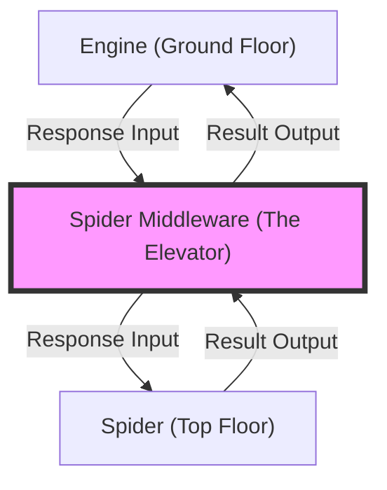

# Chapter 33: Spider Middlewares

Think about the first time you feel like Scrapy is "too smart" for you. You're trying to scrape a website that has a very strange way of handling errors. Instead of sending a `404 Not Found` code, they send a `200 OK` code, but the page just contains the word "Error."

Your spider is happily "scraping" these error pages as if they were real data. You might try to add `if "Error" in response.text` to every single one of your callback methods. It works, but your code is becoming a disaster. You have thirty different methods, and you're copy-pasting the same five lines of "error checking" into every single one of them.

You might feel like a manager who has to personally check every single box on a conveyor belt because the machines aren't calibrated correctly. You're doing manual oversight on an automated system. It's exhausting, and it's exactly the kind of "repetitive work" you started scraping to avoid.

"There has to be a central place to do this," you think. "I want to check the data *after* it leaves the spider but *before* it goes to the pipeline."

That's when you discover **Spider Middlewares**.

It's like finding the "Control Room" of the factory. You'll realize that Scrapy provides a set of hooks where you can intercept every single request and response as they travel between the Engine and the Spider. You can write one single piece of code in the middleware that checks for the word "Error," and it will automatically apply to every single callback in your entire project. Suddenly, your thirty methods are clean again. You are no longer a "box checker"; you are the factory engineer.

In this chapter, you're going to learn how to take control of that control room.

---

## Introduction

So far, we've treated Scrapy as a "black box." You give it a URL, and it gives you a Response. But what happens in between? How does the data actually move?

In this chapter, we're going to dive into the internal machinery of Scrapy using **Spider Middlewares**. These are specialized classes that allow you to "hook" into the conversation between the Scrapy Engine and your Spider. We'll learn the lifecycle of a request, how to modify data on the fly, and how to build global rules that apply to your entire project without repeating a single line of code.

## How Scrapy "Thinks": The Middleware Stack

Think of Scrapy like a multi-story building. 
*   **The Basement:** The Downloader (fetches pages).
*   **The Ground Floor:** The Engine (coordinates everything).
*   **The Top Floor:** The Spider (your code).

To get from the Ground Floor to the Top Floor, every request and response must take the "Middle Elevator." This elevator is the **Middleware Stack**. As the elevator moves up and down, you can stop it at any floor and change what's inside.



## The Middleware lifecycle

There are two main types of middleware:
1.  **Downloader Middleware:** Hook between the Engine and the Internet (fetching).
2.  **Spider Middleware:** Hook between the Engine and the Spider (processing).

In this chapter, we focus on the **Spider Middleware**. It handles two main events:
*   **Response Input:** When a page arrives from the engine to be processed by your spider.
*   **Result Output:** When your spider "yields" an item or a new request.

## Creating Your First Spider Middleware

Middlewares live in the `middlewares.py` file of your project. Here is the basic structure:

### The 4 Hooks of Spider Middleware
1. `process_spider_input(response, spider)`: Engine -> Spider
2. `process_spider_output(response, result, spider)`: Spider -> Engine
3. `process_spider_exception(response, exception, spider)`: When Spider crashes
4. `process_start_requests(start_requests, spider)`: Initial requests

```python

```python
# middlewares.py
from scrapy import signals

class MySpiderMiddleware:
    def process_spider_input(self, response, spider):
        # This runs BEFORE your 'parse' method
        if "Maintenance" in response.text:
            spider.logger.warning("Site is down!")
        return None  # None means 'keep going'

            yield r

    def process_start_requests(self, start_requests, spider):
        # 0. This runs BEFORE any request is made
        for request in start_requests:
            request.meta['global_timestamp'] = '2026-01-01'
            yield request

    def process_spider_exception(self, response, exception, spider):
        # 3. This runs if ANY of your parse methods crash
        spider.logger.error(f"CRASH ON {response.url}: {exception}")
        # Return nothing to suppress the error, or return items to "recover"
        return [] 
```

## `process_spider_input` vs `process_spider_output`

### `process_spider_input(response, spider)`
This is your last chance to look at the HTML before it reaches your spider's code. You can use this for:
*   **Global Filtering:** Dropping responses that are clearly garbage.
*   **Pre-processing:** Adding metadata to the response based on its headers.

*   **Auto-Correction:** Fixing common typos in your items globally.

### `process_spider_exception(response, exception, spider)`
This is your **Global Try/Catch**. 
Instead of wrapping every `parse` method in `try...except`, define it here.
- If you return `None`, the exception bubbles up (crash).
- If you return `[]` (empty list), the exception is silenced.
- **Pro Tip:** Use this to send errors to Sentry (Chapter 31) without crashing the spider.

## Real-World Use Case: The "Soft Error" Handler

As I mentioned in my story, many sites send "Error" pages with a `200 OK` status. Here is how a professional middleware handles it:

```python
from scrapy.exceptions import IgnoreRequest

def process_spider_input(self, response, spider):
    if "Access Denied" in response.text:
        # Stop the spider from even trying to parse this!
        raise IgnoreRequest("Access Denied page detected")
    return None
```

## Enabling the Middleware

Just like pipelines, you must enable middlewares in `settings.py`:

```python
# settings.py
SPIDER_MIDDLEWARES = {
    'my_project.middlewares.MySpiderMiddleware': 543,
}
```

## Chapter Summary

**What we covered:**
- Spider Middlewares are central "hooks" between the Scrapy Engine and your Spider code.
- They allow you to build global logic that applies to every request and response.
- `process_spider_input` runs before your parsing logic.
- `process_spider_output` runs after your spider yields data.
- Middlewares are the best place for "Cross-Cutting Concerns" like global error handling or data logging.

**Key code:**
```python
def process_spider_input(self, response, spider):
    return None # continue processing
```

**Previous chapter:**
[Chapter 32: Scheduling Spiders (Cron)](./chapter_32_scheduling_spiders_cron.md)

**Next chapter:**
We've mastered the hook inside the spider. But what about the hook inside the "Browser"? In the next chapter, we're going to explore **Downloader Middlewares** learning how to change how Scrapy fetches pages, including custom headers, proxy management, and user-agent rotation.

---

**End of Chapter 33**
